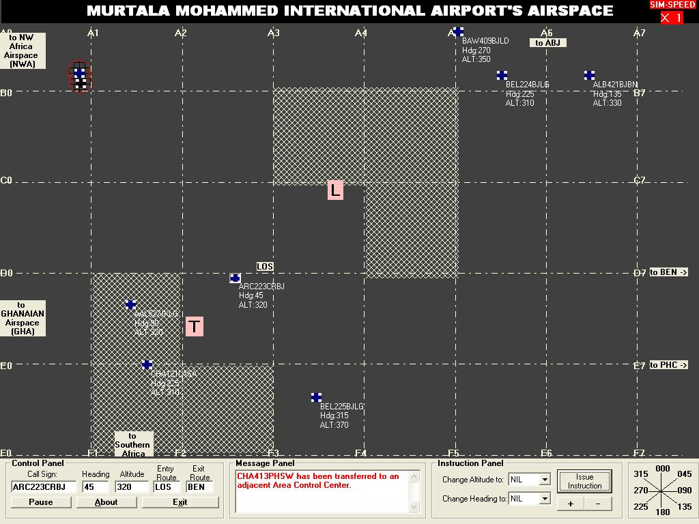



## Air Traffic Control Simulator \(ATCSim\)

### Description

A revision of my ATCSim: you are an Air Traffic Control personnel charged with the responsibility of coordinating air traffic at the higher altitudes beyond the range of vision of the Tower (300 nmi and more).

I have included cID, heading and FL to the moving targets (10x to Pete) and made a total overhaul of the U.I's look and feel, to give a "realistic" perception of a radar display.

Pls vote...if u like it. I appreciate ur comments 2
 
### More Info
 

             |
---                |---
**Submitted On**   |2006-10-13 14:10:14
**By**             |['seyi Ogunbanjo](https://github.com/Planet-Source-Code/PSCIndex/blob/master/ByAuthor/seyi-ogunbanjo.md)
**Level**          |Advanced
**User Rating**    |5.0 (10 globes from 2 users)
**Compatibility**  |VB 6\.0
**Category**       |[Complete Applications](https://github.com/Planet-Source-Code/PSCIndex/blob/master/ByCategory/complete-applications__1-27.md)
**World**          |[Visual Basic](https://github.com/Planet-Source-Code/PSCIndex/blob/master/ByWorld/visual-basic.md)
**Archive File**   |[Air\_Traffi20246910132006\.zip](https://github.com/Planet-Source-Code/seyi-ogunbanjo-air-traffic-control-simulator-atcsim__1-66211/archive/master.zip)

